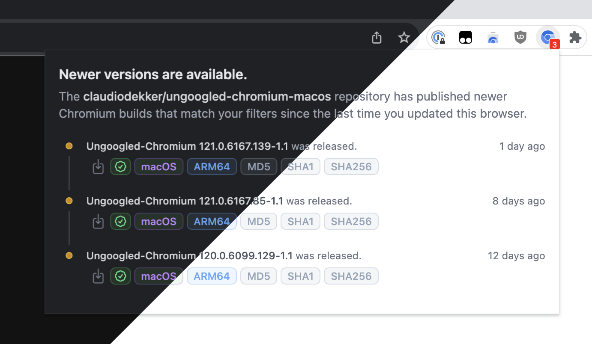

# Chromium Update Notifier

A Chrome extension that notifies you when a new version of Chromium is available,
based on when you installed the extension or last updated your browser.

## Installation

1. Go to `chrome://flags` and search for the `#extension-mime-request-handling` flag and set it to `Always prompt for install`.
2. Download the .crx from [Releases](https://github.com/claudiodekker/chromium-update-notifier/releases), you should be prompted to install the extension. 

If the above steps do not work for you, try one of the following alternative methods:

### Installation (Alternative #1)
1. Go to `chrome://extensions` and enable developer mode (toggle on top right).
2. Download the .crx from [Releases](https://github.com/claudiodekker/chromium-update-notifier/releases) and drag-and-drop it onto the `chrome://extensions` page.

### Installation (Alternative #2)
1. Download the .crx from [Releases](https://github.com/claudiodekker/chromium-update-notifier/releases) and extract the contents to a folder.
2. Visit `chrome://extensions/` and turn on developer mode (toggle on top right).
3. Click `Load unpacked` and select the directory you extracted the crx to.

## Recommended Usage

- Make sure your settings are configured to your liking. (Rightclick the Chromium Update Notifier icon and click "Options")
- Pin the Chromium Update Notifier badge in your browser's toolbar. (Badges are hidden by default)
- The badge will show a red number indicating available updates (when available).
- Click on the badge, then click on the download icon of your preferred build to download it.

## FAQ

### Q: How does it work?

The extension periodically checks the GitHub Releases page for whichever repository you're tracking, and compares the release dates with the last time you installed or updated your browser.
It then then filters releases based on your configured settings, and displays a numeric badge on the extension icon if new releases are available.

### Q: Does this extension auto-update my Chromium browser?

No, it does not. Extensions don't have the capability to update the browser itself, and as such you'll have to do this manually.
It does however make life a bit easier by indicating when a new version is available, and by making downloading the new version a bit easier.

### Q: Why do I not see any releases? My browser is outdated, and..

> **TL;DR**: Don't worry about it. Once a new release that matches your settings gets released in the future, you'll see it.

Unfortunately the extension has no way of detecting the exact browser's build version, and as such doesn't know whether it's outdated or not.

To work around this, we're [listening for a browser install/update event](https://developer.chrome.com/docs/extensions/reference/api/runtime#event-onInstalled) instead,
and keep track of when this last happened, so we can compare it against the release dates of the repository you're tracking.

However, when you first install the extension, it won't have a last-detected installation/update moment to compare against,
and as such will instead simply assume that your browser is up-to-date as of that very moment, using that as it's initial reference point. 

Because of this, you won't see any releases until a new one gets published _after_ you installed the extension.

### Q: How do I check for releases in a different repository?

You can change the repository in the settings page of the extension (rightclick the icon and click "Options").
Do note that only a handful of repositories are supported, due to them publishing releases in a consistent manner on their GitHub.

If you're maintaining a repository and would like to be added to the list, please open an issue or a pull request.

### Q: I'm only seeing releases for architecture X, how do I see architecture Y?

By default, the extension is configured to detect your OS and architecture, and only filter releases relevant to it.
You can change this in the settings page of the extension (rightclick the icon and click "Options").

### Q: How do I update this extension, or make sure it's auto-updated?

The recommended approach would be to use [NeverDecaf/chromium-web-store](https://github.com/NeverDecaf/chromium-web-store), as it will automatically check for updates and notify you when one is available.

Alternatively, you can manually update the extension from time to time by following the installation instructions again.

## Changelog

Please see [CHANGELOG](CHANGELOG.md) for more information what has changed recently.

## Contributing

Please see [CONTRIBUTING](CONTRIBUTING.md) for details.

## Security

If you discover any security related issues, please email claudio@ubient.net instead of using the issue tracker.

This way, we can safely discuss and resolve the issue (within a reasonable timeframe), without exposing users to the unnecessary additional risk.
Once the issue is fixed and a new version is released, we'll make sure to credit you for your contribution (unless you wish to remain anonymous).

## License

The MIT License (MIT). Please see [License File](LICENSE.md) for more information.
